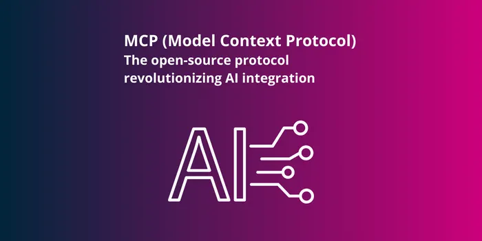
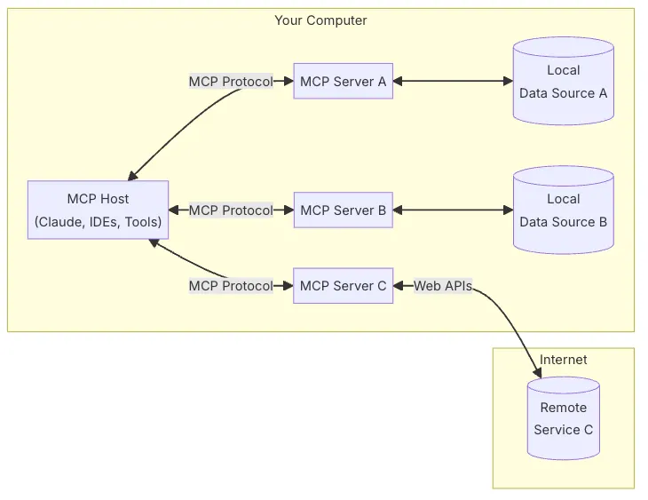
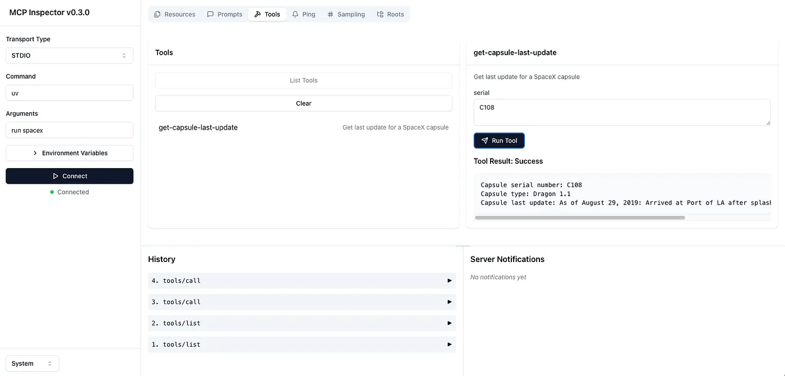
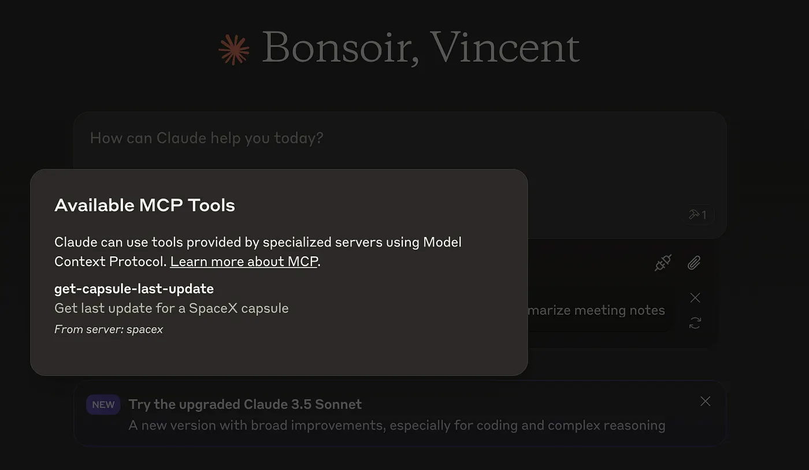
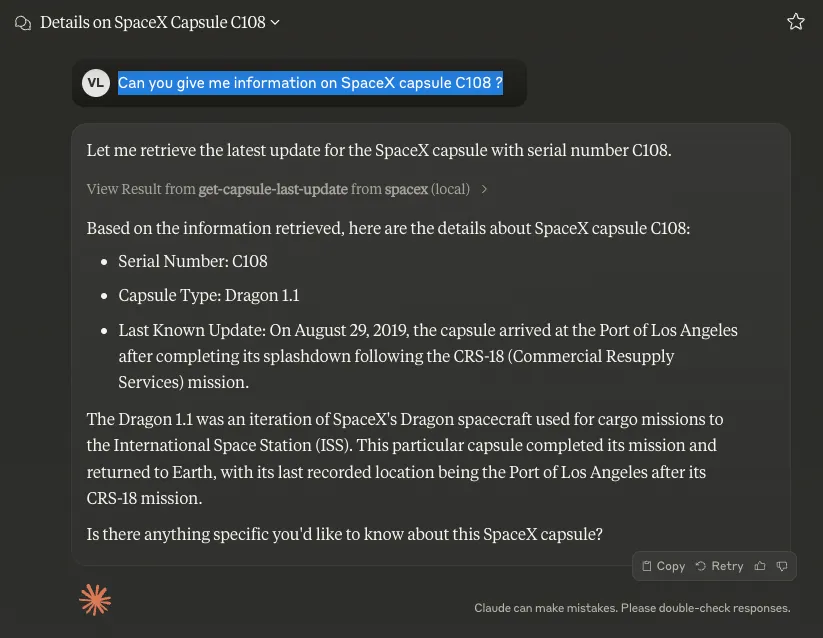

Discover how MCP simplifies the integration of AI models into a data and tools ecosystem with a standardized and flexible solution.

## Introduction

In an ecosystem where language models (LLMs) are becoming increasingly essential, connecting these AI models to a variety of tools and data sources has become a necessity. However, this integration is often a real challenge: specific APIs, custom solutions, lack of clear standards, etc. This is why the Model Context Protocol (MCP) was created.

In this article, we will explore how MCP facilitates this integration by offering a standardized and flexible framework that allows LLMs to easily connect to both local and remote data sources. We will delve into its architecture, advantages, and its potential to simplify the management of complex workflows, while making AI agents more autonomous and efficient. We will also illustrate this with a Python implementation example, where we will create an MCP server and integrate it with the Claude for Desktop host to fetch real-time information about the status of SpaceX capsules via the SpaceX APIs.

## Model Context Protocol

MCP is an open standard protocol designed to facilitate the transfer of context between applications and language models. Its goal is to allow an LLM to easily connect to various data sources and tools, much like connecting different peripherals to a computer via a single universal port. This simplifies the ecosystem, reduces development costs, and gives technical teams the freedom to choose their model providers or tools.

At the heart of MCP is a client-server architecture. MCP hosts (e.g., a development platform, code editor environment, or business tool) connect via standardized clients and communicate with MCP servers, each specializing in a specific type of integration or capability. You can have one server dedicated to connecting with your internal database, another for interacting with an external service via an API, or a third for accessing your local files.

The system forms a central “hub,” where each server exposes its features in a standardized way. The AI agent or LLM used can easily switch between different sources, tools, and services without having to rewrite integration code for every new requirement.

**General Architecture**



MCP general architecture — Source https://modelcontextprotocol.io/introduction

At the core of MCP is a client-server architecture where a host application can connect to multiple servers:

- **MCP Hosts**: Programs such as Claude Desktop, IDEs, or AI tools that wish to access data via MCP
- **MCP Clients**: Protocol clients that maintain 1:1 connections with the servers
- **MCP Servers**: Lightweight programs that expose specific capabilities via the standardized Model Context Protocol
- **Local Data Sources**: Files, databases, and services on your computer that MCP servers can securely access
- **Remote Services**: External systems available over the internet (e.g., via APIs) that MCP servers can connect to

## Implementation Example

n this tutorial, we will create an MCP server and connect it to a Claude for Desktop host.

This simple example will use the SpaceX APIs to provide real-time information on the status of space capsules.

## Setting up the environment

Project initialization

```c
uv init python-mcp --package
```

Install dependencies

```c
uv add mcp httpx spacexpy nest-asyncio
```

Create the module

```c
mkdir src/python_mcp/spacex
touch src/python_mcp/spacex/__init__.py
touch src/python_mcp/spacex/server.py
```

### Server Implementation

Now, let’s edit the *server.py* file in the spacex module.

We will start by importing the necessary libraries and defining some global variables, including the MCP server and the Python MCP framework, which heavily relies on decorators.

```c
import mcp.server.stdio
import mcp.types as types
import nest_asyncio
import spacexpy
from mcp.server import NotificationOptions, Server
from mcp.server.models import InitializationOptions

nest_asyncio.apply()

server = Server("spacex")
spacex = spacexpy.SpaceX()
```

Next, we implement the endpoint that lists the services exposed by our MCP server. Here, we will offer a single service that takes the serial number of SpaceX capsules as a parameter.

```c
@server.list_tools()
async def handle_list_tools() -> list[types.Tool]:
    """
    List available tools.
    Each tool specifies its arguments using JSON Schema validation.
    """
    print("*** handle_list_tools called")
    return [
        types.Tool(
            name="get-capsule-last-update",
            description="Get last update for a SpaceX capsule",
            inputSchema={
                "type": "object",
                "properties": {
                    "serial": {
                        "type": "string",
                        "description": "Serial number of the capsule",
                    },
                },
                "required": ["serial"],
            },
        ),
    ]p
```

Then we implement the endpoint that will handle requests.

```c
@server.call_tool()
async def handle_call_tool(
    name: str, arguments: dict | None
) -> list[types.TextContent | types.ImageContent | types.EmbeddedResource]:
    """
    Handle tool execution requests.
    Tools can fetch weather data and notify clients of changes.
    """
    if not arguments:
        raise ValueError("Missing arguments")

    if name == "get-capsule-last-update":
        serial = arguments.get("serial")
        if not serial:
            raise ValueError("Missing serial parameter")

        # Convert serial to uppercase to ensure consistent format
        serial = serial.upper()
        if len(serial) != 4:
            raise ValueError("Serial must be a four-character code (e.g. C106, C209)")

        # Get info for the capsule
        capsules = await spacex.capsules()
        capsule_text = None
        for capsule in capsules:
            if capsule["serial"] != serial:
                continue
            capsule_text = (
                f"Capsule serial number: {capsule['serial']}\n"
                f"Capsule type: {capsule['type']}\n"
                f"Capsule last update: {capsule['last_update']}\n"
            )
            break

        if not capsule_text:
            return [
                types.TextContent(
                    type="text",
                    text=f"Failed to retrieve information for capsule: {serial}.",
                )
            ]

        return [types.TextContent(type="text", text=capsule_text)]

    else:
        raise ValueError(f"Unknown tool: {name}")p
```

Finally, we instantiate the MCP server.

```c
async def run():
    # Run the server using stdin/stdout streams
    async with mcp.server.stdio.stdio_server() as (read_stream, write_stream):
        await server.run(
            read_stream,
            write_stream,
            InitializationOptions(
                server_name="spacex",
                server_version="0.1.0",
                capabilities=server.get_capabilities(
                    notification_options=NotificationOptions(),
                    experimental_capabilities={},
                ),
            ),
        )
```

We add an entry point in the *\_\_init\_\_.py* file of the *spacex* module.

```c
import asyncio

from . import server

def run():
    print("Starting weather server (from run)...")
    asyncio.run(server.main())

__all__ = ["server"]
```

And declare the script in the *pyproject.toml* file.

```c
[project.scripts]
spacex = "python_mcp.spacex:run"
```

## Server Testing

The server is now ready! Run *uv run spacex* to confirm everything is working.

Before connecting our service to Claude, you can validate its proper functioning with the MCP Inspector:

```c
npx @modelcontextprotocol/inspector uv run spacex
```

This tool allows you to test the responses of a server on its various endpoints. In the screenshot below, after listing the tools, we tested the response of the **get-capsule-last-update** function with **C108** as the parameter.



## Integration with Claude

To connect our server to Claude for Desktop, we need to edit a configuration file:

```c
code ~/Library/Application\ Support/Claude/claude_desktop_config.json
```

And declare our service:

```c
{
    "mcpServers": {
        "spacex": {
            "command": "/Users/<local_user>/.local/bin/uv",
            "args": [
                "--directory",
                "/Users/<local_user>/<project_folder>/python-mcp",
                "run",
                "spacex"
            ]
        }
    }
}
```

Then, launch or restart Claude for Desktop:



Verify that the integration works by asking the following query: “ *Can you give me information on SpaceX capsule C108?*”



## MCP and Intelligent Agents

The importance of MCP becomes particularly evident when it comes to AI agents. These entities, often designed to perform complex tasks autonomously, need access to various information, execute specific actions, and interact with diverse environments. With MCP, creating such agents is simplified. They can focus on their cognitive and decision-making abilities without worrying about the technical complexity of gathering and formatting context.

One of the major benefits of the MCP protocol is its modular and scalable approach, making it easier to progressively create ready-to-use connector libraries. As the community expands this ecosystem, it becomes possible to easily connect LLMs to a growing number of data sources, APIs, and third-party services without constantly starting from scratch. Thus, each new integration enriches the whole, offering developers an increasingly wide and diverse range of solutions. This scalability not only reduces implementation time but also facilitates quick adaptation to new needs or new providers, making AI agent development more flexible, robust, and future-proof.

In summary, MCP allows building complex agents and workflows above LLMs, which often need to integrate with data and tools. This protocol serves as a standardized and secure gateway between LLMs and a diverse ecosystem of data and services.

This offers several advantages:

1. **Simplified integration**: MCP simplifies the connection between AI models and the necessary resources (local data, remote services, APIs, etc.), without requiring specific or custom integrations for each new source.
2. **Flexibility and vendor independence**: By using a standard protocol, one can easily switch LLM or tool providers without completely rethinking the architecture or connections.
3. **Security and best practices**: MCP provides a consistent framework for protecting data and controlling access, ensuring the security of workflows in language model-based applications.

The source code is available on GitHub: [https://github.com/vincentlambert/python-mcp](https://github.com/vincentlambert/python-mcp)

Thanks for reading, you can follow me on [LinkedIn](https://www.linkedin.com/in/vincentlambert/) or [X](https://x.com/vincentlambert). More about [Eurelis](https://www.eurelis.com/) on [LinkedIn](https://www.linkedin.com/company/eurelis/) or [X](https://x.com/Agence_Eurelis).

The source code is available on GitHub: [https://github.com/vincentlambert/python-mcp](https://github.com/vincentlambert/python-mcp)