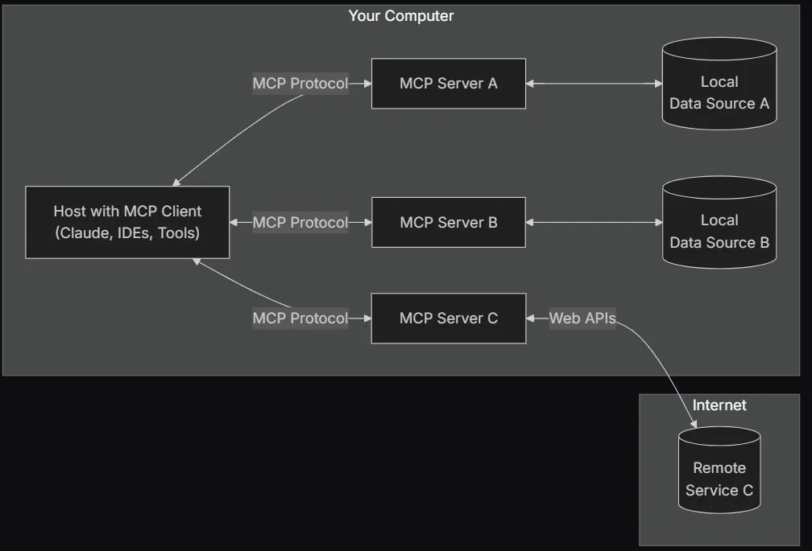

## Introduction to the Model Context Protocol (MCP)

The **Model Context Protocol (MCP)** is an open standard that streamlines the integration of AI assistants with external data sources, tools, and systems. Developed by **Anthropic**, MCP is designed to solve the challenge of providing AI models with real-time, relevant, and structured information while maintaining security, privacy, and modularity.



[https://modelcontextprotocol.io/introduction](https://modelcontextprotocol.io/introduction)

MCP aims to act as the **“USB-C for AI integrations”**, allowing a **one-to-many connection** between AI applications and diverse data repositories, tools, or APIs. It standardizes how AI assistants query and interact with external sources, thus reducing the complexity of multiple, custom integrations.

## Explaining MCP in Simple Terms (with Analogies)

Imagine you have a **universal remote control** that can operate all your devices — TV, speakers, lights, and even your coffee machine — without needing separate remotes for each one.

Now, think of **AI models** (like ChatGPT, Claude, or LLaMA) as **smart assistants** that need to fetch information or perform tasks from different sources (like databases, APIs, or company documents). The problem is, without a universal way to communicate, each AI model would need a custom integration for every data source — like having different remotes for each device.

## Enter the Model Context Protocol (MCP): The Universal Remote for AI

MCP acts like a **universal adapter** that lets AI models **connect to any system** using a standard method. Instead of building custom connections for every data source, MCP provides a **single plug-and-play interface** that any AI model can use to fetch information or execute tasks.

## Analogy: A Restaurant Waiter

Think of MCP as a **waiter at a restaurant**:

- You (the AI assistant) sit at a table and place an order.
- The waiter (MCP) takes your order and brings it to the kitchen (various databases, APIs, or tools).
- The kitchen (MCP Server) processes the order (fetches data or runs a function) and hands it back to the waiter.
- The waiter returns with your dish (the required data or action result).

Instead of you going into the kitchen and cooking yourself (direct API integrations), you just tell the waiter what you need, and MCP handles the rest.

## Why MCP Matters?

- **Standardization:** AI models can work with any tool or database using a single protocol.
- **Security & Control:** Data access can be **restricted and logged**, ensuring privacy.
- **Efficiency:** No need to build separate integrations for every system — just use MCP.

## Real-Life Example:

- Instead of manually searching your company’s Google Drive for a report, your AI assistant using MCP can **instantly retrieve** the latest document.
- Instead of coding a weather API integration, you can use an MCP tool that **already knows how to fetch the weather**.

## Bottom Line:

MCP is the **universal translator and connector** that allows AI assistants to interact with different systems **seamlessly, securely, and efficiently** — just like a **waiter for AI** or a **universal remote for information access**. 🚀

This guide serves as a **comprehensive reference** for understanding, implementing, and leveraging MCP in real-world applications.

## 1\. Technical Architecture of MCP

MCP follows a **client-server architecture** with three primary components:

## 1.1. Key Components

- **MCP Host**: The AI-powered **application** that initiates connections and queries MCP servers. Examples include AI-powered IDEs, chat assistants, or business intelligence platforms.
- **MCP Client**: The **interface layer** inside the host application that manages one-to-one connections with MCP servers. It standardizes requests, processes responses, and handles security/authentication.
- **MCP Server**: The **service** exposing contextual data, tools, or APIs through the MCP standard. A server can provide structured data (documents, databases), allow execution of actions (API calls, script execution), or define AI-enhancing prompts.

## 1.2. Communication Mechanism

MCP uses **JSON-RPC 2.0** as its communication protocol and supports multiple transport methods:

- **Stdio (Standard Input/Output)**: Used for local integrations within the same environment.
- **HTTP with Server-Sent Events (SSE)**: Used for network-based communication to facilitate real-time updates and long-lived connections.
- **WebSockets (Future Development)**: Proposed for real-time bidirectional communication.

## 1.3. Context Types

MCP servers expose three types of AI context:

- **Resources**: Structured data (e.g., files, database queries, API responses) to provide relevant real-time information to the AI.
- **Tools**: Executable functions that allow AI to interact with external services (e.g., triggering an API call, sending an email, updating records in a CRM).
- **Prompts**: Predefined templates or instructions that influence AI response generation.

## 2\. Use Cases and Industry Adoption

## 2.1. Enterprise AI Assistants

MCP enables AI assistants to retrieve company-specific information (e.g., HR policies, project documents, sales figures) without compromising security. Examples include:

- AI-powered helpdesk pulling knowledge base articles.
- Legal AI assistant retrieving compliance documentation.

## 2.2. Developer Productivity Tools

Several IDEs and code intelligence tools have started adopting MCP, such as:

- **Sourcegraph**: Using MCP to allow AI-based code search within repositories.
- **Replit**: Enabling AI assistants to fetch relevant project files via MCP servers.

## 2.3. AI Agents & Automation

MCP powers **autonomous AI agents** capable of multi-step task execution:

- AI scheduling meetings via a calendar integration.
- AI assistants autonomously generating reports using connected databases.

## 2.4. Research and Education

Educational AI tutors can access academic papers and research databases using MCP-based data sources.

## 3\. Implementing MCP

## 3.1. Setting Up an MCP Server

MCP servers can be built in multiple programming languages using existing SDKs:

### Python Implementation Example:

```c
from mcp.server import MCPServer

class ExampleMCPServer(MCPServer):
    def list_resources(self, params):
        return {"documents": ["file1.txt", "file2.pdf"]}

    def run_tool(self, tool_name, params):
        if tool_name == "get_weather":
            return {"weather": "Sunny, 72F"}
        return {"error": "Tool not found"}
server = ExampleMCPServer()
server.start()
```

## 3.2. Setting Up an MCP Client

### JavaScript Example (Node.js):

```c
const { MCPClient } = require('mcp-client');
const client = new MCPClient("http://localhost:5000");

async function fetchResources() {
    const response = await client.request("list_resources", {});
    console.log(response);
}
fetchResources();
```

## 3.3. Connecting an AI Model with MCP

Once an MCP client is set up, it can be integrated into AI workflows (e.g., **Claude AI**, **LLaMA**, **OpenAI GPT**):

```c
response = ai_model.generate(
    prompt="Summarize this document:",
    context=mcp_client.request("list_resources", {})
)
print(response)
```

## 4\. Security & Privacy Considerations

## 4.1. Secure Data Transmission

MCP recommends using **TLS encryption** for all HTTP-based transmissions.

## 4.2. Authentication & Access Control

- OAuth 2.0 authentication is planned for future MCP releases.
- Role-Based Access Control (RBAC) is encouraged for enterprise deployments.

## 4.3. Logging & Monitoring

MCP supports logging requests and responses for **auditability and compliance**.

## 5\. Future Roadmap

## 5.1. Enhancements & Standardization

- **OAuth 2.0 Authentication** for secure API access.
- **GraphQL Support** for complex queries.
- **MCP Registry** for publicly available server connectors.

## 5.2. Expanded Adoption

- Integration into cloud providers like **AWS**, **Azure**, and **GCP**.
- Industry-wide adoption for **financial, healthcare, and legal AI applications**.

## 6\. References & Further Reading

- **Anthropic Official MCP Announcement:** [https://www.anthropic.com/news/model-context-protocol](https://www.anthropic.com/news/model-context-protocol)
- **MCP Official Documentation:** [https://modelcontextprotocol.io/docs/](https://modelcontextprotocol.io/docs/)
- **GitHub SDKs and Implementations:** [https://github.com/model-context-protocol](https://github.com/model-context-protocol)
- **Technical Deep Dive:** [https://www.theverge.com/2024/11/25/24305774/anthropic-model-context-protocol](https://www.theverge.com/2024/11/25/24305774/anthropic-model-context-protocol)

## Conclusion

The **Model Context Protocol (MCP)** is poised to become the industry standard for AI integrations, offering **modularity, security, and efficiency**. Whether you’re building an AI assistant, enterprise tool, or research application, MCP provides a **scalable, interoperable framework** to connect AI with the real world.

By adopting MCP, developers and enterprises can **reduce integration complexity, enhance AI capabilities, and ensure secure data handling**. This guide serves as a **one-stop reference** to help you understand, implement, and leverage MCP effectively.

> **About Me🚀**
> Hello! I’m Toni Ramchandani 👋. I’m deeply passionate about all things technology! My journey is about exploring the vast and dynamic world of tech, from cutting-edge innovations to practical business solutions. I believe in the power of technology to transform our lives and work. 🌐
>
> Let’s connect at [**https://www.linkedin.com/in/toni-ramchandani/**](https://www.linkedin.com/in/toni-ramchandani/) and exchange ideas about the latest tech trends and advancements! 🌟
>
> **Engage & Stay Connected 📢
> **If you find value in my posts, **please Clap 👏 | Like 👍 and share 📤 them**. Your support inspires me to continue sharing insights and knowledge. Follow me for more updates & let’s explore the fascinating world of technology together! 🛰️